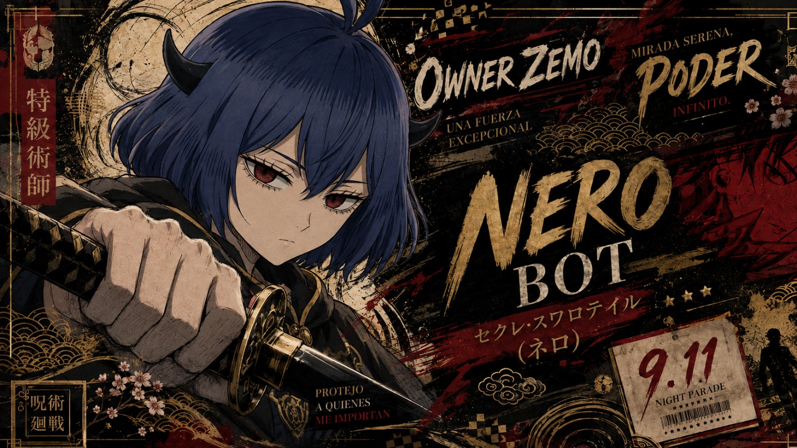

<div align="center">



# ⚔️ Nero Bot AI

### Un bot de WhatsApp modular, multi-instancia y orientado a automatización, entretenimiento y comunidades.

**Creado y mantenido por © ArcadiaCorps**

<p>
  
  
  
  
</p>

[](https://arcadiacorps.online/web-v2/)
[](https://whatsapp.com/channel/0029VbADsUx6LwHo4wdirM0v)
[](https://chat.whatsapp.com/FhtYMXvnTs6B32bOe2Bs3f?s=cl&p=a&ilr=4)
[](https://t.me/SoyZemo)
[](https://www.paypal.me/pragmatabot)

</div>

---

> [!IMPORTANT]
> **Nero Bot AI está en evolución constante.** ArcadiaCorps trabaja continuamente en nuevas funciones, estabilidad, seguridad y compatibilidad con WhatsApp.  
> Únete al canal y a la comunidad para enterarte de cambios, mantenimiento y nuevas versiones.

<div align="center">


</div>

## ✨ ¿Qué es Nero Bot AI?

**Nero Bot AI** es un proyecto de automatización para WhatsApp desarrollado por **ArcadiaCorps**. Combina administración de grupos, descargas multimedia, inteligencia artificial, SubBots, juegos, utilidades, stickers, Gacha, búsquedas, seguridad y herramientas de comunidad en una sola plataforma.

El proyecto está pensado para trabajar tanto como **bot principal** como mediante múltiples **SubBots**, manteniendo configuración independiente por instancia y control de acceso para Owner/SubOwner.

### Características destacadas

- 🤖 Bot principal + sistema de **SubBots**.
- 🔐 Roles Owner/SubOwner y controles protegidos.
- 🛡️ Administración y seguridad de grupos.
- 📥 Descargas multimedia con colas ligeras y pesadas.
- 🎬 Fallback para videos grandes mediante archivos MP4 y división en partes.
- 🎮 Juegos y comandos de entretenimiento.
- 🎴 Sistema Gacha.
- 🖼️ Stickers, filtros y generadores.
- 🤖 Inteligencia artificial.
- 🔎 Búsquedas, stalking público y consultas.
- 👋 Bienvenidas/despedidas personalizables con imagen.
- 🌐 Integración con el ecosistema web de ArcadiaCorps.

---

## 🌐 Enlaces oficiales

| Servicio | Enlace |
|---|---|
| 🌐 Web | [ArcadiaCorps](https://arcadiacorps.online/web-v2/) |
| 📢 Canal de WhatsApp | [Canal oficial](https://whatsapp.com/channel/0029VbADsUx6LwHo4wdirM0v) |
| 👥 Comunidad de WhatsApp | [Entrar a la comunidad](https://chat.whatsapp.com/FhtYMXvnTs6B32bOe2Bs3f?s=cl&p=a&ilr=4) |
| ✈️ Telegram | [@SoyZemo](https://t.me/SoyZemo) |
| 📧 Correo | [imperioarcadia2016@gmail.com](mailto:imperioarcadia2016@gmail.com) |
| 💙 PayPal | [paypal.me/pragmatabot](https://www.paypal.me/pragmatabot) |

---

<details>
<summary><b>👑 Owners y equipo</b></summary>

### 🌟 Owners

**Zemo**  
[](https://wa.me/51917611323)

**Smith**  
[](https://wa.me/51921909260)

### 🤖 Número oficial del bot

[](https://wa.me/51972564492)

### 🧑🏻‍🔧 Soporte

**Mily**  
[](https://wa.me/528691009825)

**Kiwi**  
[](https://wa.me/526636649636)

</details>

---

## 📚 Comandos y módulos

<details>
<summary><b>🔎 Búsquedas y descargas</b></summary>

```text
.play
.tts / .tiktoks
.spotify
.ytmusic
.applemusic
.wikipedia
.tiktok / .tt
.ytmp3
.ytmp4
.facebook / .fb
.instagram / .ig
.twitter / .x
.reddit
.bilibili
.threads
.mediafire
.mega
.terabox
.gitclone
.npmdl
```

Las descargas pesadas usan una cola independiente. Los videos de YouTube que no pueden enviarse normalmente pueden pasar a modo **archivo MP4** y dividirse automáticamente cuando sea necesario.

</details>

<details>
<summary><b>🎮 Juegos y diversión</b></summary>

```text
.ttt [@usuario]
.movie
.pareja [@usuario] [@usuario]
.testgay [@usuario]
.ppt piedra|papel|tijera
.dado
.moneda
```

> Los tests tipo meme son resultados de entretenimiento y no representan características reales de los usuarios.

</details>

<details>
<summary><b>🛡️ Administración de grupos</b></summary>

```text
.antinsfw on|off
.antilink on|off
.bienvenida on|off
.despedida on|off
.setbienvenida
.setdespedida
.setimgbienvenida
.setimgdespedida
.promote
.demote
.kick
.warn
.warns
.resetwarn
.abrir
.cerrar
.tagall
.hidetag
.hidetagall
.del
```

</details>

<details>
<summary><b>🤖 SubBots y control de instancia</b></summary>

```text
.code
.bots
.setbot
.principal
.resetprincipal
.logout
.modo
```

`.setbot`, `.resetprincipal`, `.modo` y sus callbacks internos están protegidos para **Owner/SubOwner**.

</details>

<details>
<summary><b>🖼️ Stickers y contenido</b></summary>

```text
.sticker / .s
.menusticker
.setmeta
.delmeta
.pfp
.qc
.toimg
.brat
.ttp
.attp
.emojimix
.wm
.textosticker
.setpack
.setauthor
.stickermeta
.stickersearch
```

</details>

<details>
<summary><b>🎴 Gacha</b></summary>

```text
.w
.claim
.harem
.character
.wish
.balance
.daily
.trade
.market
.battle
.gachastats
.topgacha
.gachaprofile
.gachainfo
```

</details>

---

## 📱 Instalación por Termux

> [!WARNING]
> Termux depende del dispositivo, versión de Android, red y disponibilidad de paquetes. Para uso permanente o muchas instancias se recomienda un VPS.

<details>
<summary><b>⚡ Instalación automática / rápida</b></summary>

### 1. Preparar Termux

```bash
termux-setup-storage
pkg update -y
pkg upgrade -y
pkg install -y git nodejs ffmpeg
```

### 2. Clonar Nero

```bash
git clone https://github.com/destroyer2014/Nero-Bot-.git
cd Nero-Bot-
```

### 3. Instalar dependencias

```bash
npm install
```

### 4. Configurar variables

```bash
cp .env.example .env
nano .env
```

Configura las claves/API que utilizará tu instancia. **Nunca publiques el archivo `.env`.**

### 5. Ejecutar

```bash
npm start
```

Mantén Termux abierto durante la vinculación inicial.

</details>

<details>
<summary><b>🛠️ Actualizar Nero Bot</b></summary>

```bash
cd ~/Nero-Bot-
git pull origin main
npm install
npm run check
npm start
```

Si utilizas una ruta diferente, entra primero a la carpeta donde clonaste el repositorio.

</details>

<details>
<summary><b>🔐 Recomendaciones de seguridad</b></summary>

- No publiques `.env`.
- No publiques `sessions/`.
- No compartas códigos de vinculación.
- Usa cuentas y números que controles.
- Mantén Node.js y las dependencias actualizadas.
- Antes de actualizar en producción ejecuta `npm run check`.
- Utiliza Owner/SubOwner solo con personas de confianza.

</details>

---

## 🖥️ VPS / Producción

Para una instalación estable 24/7 se recomienda **Ubuntu + Node.js 20+ + PM2 + FFmpeg**.

Ejemplo de ejecución:

```bash
npm install
npm run check
pm2 start src/index.js --name nero-bot
pm2 save
```

Los SubBots pueden ejecutarse como procesos independientes bajo PM2.

---

<div align="center">


</div>

## 🧩 Proyecto en evolución

Nero Bot AI recibe actualizaciones frecuentes. Algunas funciones dependen de APIs externas y de cambios en WhatsApp/Baileys, por lo que su disponibilidad puede variar.

Para reportar errores:

1. Guarda la evidencia del error.
2. Utiliza `.reportar <motivo>` dentro de Nero cuando esté disponible.
3. Contacta al equipo mediante la comunidad, Telegram o correo.
4. Nunca publiques credenciales ni sesiones en reportes públicos.

---

## 💙 Apoya el proyecto

Si Nero Bot AI y ArcadiaCorps te resultan útiles, puedes apoyar el desarrollo:

[](https://www.paypal.me/pragmatabot)

Todo apoyo contribuye al mantenimiento de infraestructura, desarrollo y nuevas funciones.

---

## 📜 Licencia

Este proyecto se distribuye bajo la **MIT License**.

Puedes usar, copiar, modificar, fusionar, publicar y distribuir el software siempre que conserves el aviso de copyright y la licencia correspondiente.

Consulta [`LICENSE`](LICENSE) para ver los términos completos.

---

## ⚠️ Aviso

Nero Bot AI no es un producto oficial de WhatsApp ni de Meta. El usuario es responsable del uso que haga del software, de cumplir las normas de las plataformas y de respetar la legislación aplicable.

---

<div align="center">


### ⚔️ Nero Bot AI
**Made With © ArcadiaCorps**

[Web](https://arcadiacorps.online/web-v2/) •
[Canal](https://whatsapp.com/channel/0029VbADsUx6LwHo4wdirM0v) •
[Comunidad](https://chat.whatsapp.com/FhtYMXvnTs6B32bOe2Bs3f?s=cl&p=a&ilr=4) •
[Telegram](https://t.me/SoyZemo) •
[Soporte](mailto:imperioarcadia2016@gmail.com)

</div>
